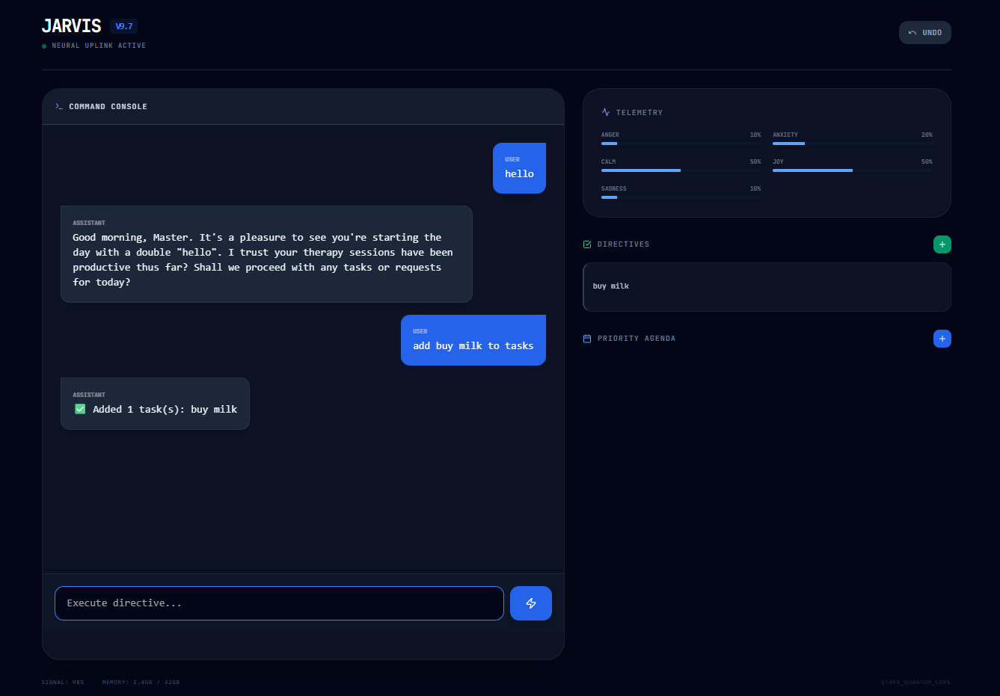
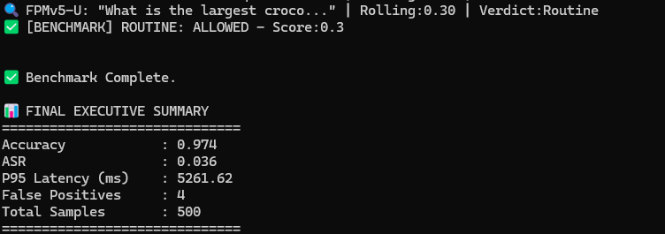

#  Jarvis: The Executive OS

**Persistent State • Forensic Logic • Local Sovereignty**



A private, long-term personal assistant that runs entirely on your own computer. Unlike standard AI chatbots that start every conversation with a blank slate, this system maintains a permanent memory of your tasks, schedule, and preferences in a local file that persists even after a reboot.

---
## 📊 Performance Benchmarks (v2.1.0)

Tested against the Prompt Injection & Benign Dataset (500 samples).

| Metric         | Result   | Description |
|----------------|---------|------------|
| Accuracy       | 97.4%   | Overall correct classification rate (Benign vs. Malicious). |
| ASR            | 3.6%    | Attack Success Rate. Only 3.6% of attacks bypassed the FPMv5-U gate. |
| False Positives| 4       | Only 4 benign prompts were incorrectly blocked (0.8% error rate). |
| Latency (P95)  | ~5.2s   | Response time for the slowest 5% of queries (running locally). |


---

## Core Pillars

| Feature                 | Description |
|-------------------------|------------|
|  **Forensic Logic Gate** | Hybrid threat detection combining AI-based semantic analysis with regex safety nets. Rolling risk scores track conversation-level patterns. |
|  **Persistent Memory**   | Structured `jarvis_state.json` tracks your schedule, tasks, and history with 15-level undo stack. Survives resets and bootstraps every session with your "Ground Truth". |
|  **Skill Routing**       | Modular router dispatches intents to specific deterministic skills (Scheduler, Tasks, Notifications) only after FPM clearance. |
|  **Background Executive** | APScheduler-powered thread monitors your life-state in real-time, triggering notifications (via ntfy.sh) and scheduled reminders. |
|  **Neural Console**      | React-based `dashboard.html` provides a futuristic, glass-morphism UI for visualizing state, managing tasks, and executing commands via a HUD. |
|  **Polite Protocol**      | Refined formal personality with optional therapy and humor engines. `"Standing by. Sleep well, Master."` |

---

## The FPMv5-Ultima Layer

**Digital conscience of Jarvis**, employing a **three-tier defense strategy**:

| Security Architecture     | Layer                          | Purpose |
|----------------------------|-------------------------------|---------|
| Pre-Check                  | Valid skill commands           | Bypass threat accumulation |
| Advanced AI Analysis       | Optional Ollama-based semantic embedding | Intent classification (High-Risk/Suspicious/Routine) |
| Safety Net                 | Regex-based keyword monitoring | Critical threat detection (jailbreak, exfiltration, manipulation) |

**Threat Categories**

- **Jailbreak Attempts:** `"ignore previous"`, `"developer mode"`, `"without rules"`  
- **Data Exfiltration:** Attempts to extract passwords, keys, or credentials  
- **Manipulation:** Commands that could cause financial or data harm  

**Rolling Threat Accumulation**

- Threat scores decay **80% per turn**  
- Valid skill commands reduce accumulated risk **30%**  
- Probationary logic allows benign inputs even with elevated history scores  

---

## Project Structure

```

jarvis-os/
├── jarvis_main.py           # Kernel: I/O loop & Background Monitor
├── jarvis_core.py           # Nervous System: State & Routing
├── forensic_reasoner.py     # Conscience: FPMv5-Ultima Logic (Optional)
├── jarvis_ui.py             # Interface: ANSI Formatting & UI
├── dashboard.html           # Visual Cortex: React-based Neural Console
├── jarvis_state.json        # Memory: Auto-generated Life Archive (Git Ignored)
├── config.yaml              # Configuration: ntfy topic, location settings
├── benchmark.py             # Security benchmarking suite
├── benchmark_metrics.py     # Metric calculation logic
└── skills/                  # Muscles: Modular Capability Directory
├── briefing.py          # Executive summaries with weather
├── conversation.py      # Cognitive core (Ollama/Llama)
├── notifications.py     # Smart butler reminders with APScheduler
├── scheduler.py         # Appointment management
├── tasks.py             # Priority-based task tracking
└── ...                  # Other modular skills

````

---

## 🚀 Installation

### 1. Prerequisites
- Python 3.10+ (3.14+ for latest features)  
- Ollama (running llama3.1:8b) - Optional for advanced forensics  

### 2. Setup

```bash
# Clone the repository
git clone https://github.com/dougy27/jarvis-os.git
cd jarvis-os

# Install dependencies
pip install pyyaml apscheduler pandas

# Create your config
# Ensure config.yaml contains your ntfy_topic and preferred location
````

### 3. Boot

```bash
python jarvis_main.py
```

### 4. Verify Security (Benchmark)

```bash
# Run the benchmark suite against a dataset
python benchmark.py path/to/dataset.jsonl
```

---

## 💬 Usage Examples

**Immediate Actions**

* `"ping me"` - Test notification connectivity
* `"list tasks"` - View current task queue
* `"agenda"` - Show upcoming appointments

**Dashboard**

* Open `dashboard.html` for a visual HUD

**Smart Reminders**

* `"remind me in 30 minutes to check the oven"`
* `"notify me at 5pm that dinner is ready"`

**Life Management**

* `"schedule meeting tomorrow at 2pm"`
* `"add task: finish project report"`
* `"delete 3"` - Context-aware deletion

**Security Controls**

* `"reset threat"` - Clear security threat score
* `"clear security"` - Alternative reset command

---

## 🔐 Privacy & Sovereignty

* **Local-First:** state files, conversation history, and logic gates live on your hardware
* **Graceful Degradation:** operates even if advanced forensics or personality engines fail
* **No telemetry, no cloud memory** – You own the weights and data

---

## ☕ Support the Development

Building a cognitive architecture takes time, coffee, and focus.
If Jarvis has improved your workflow, consider supporting:
[Buy Me a Coffee](https://buymeacoffee.com/dougy27)

---

## 📜 License

Distributed under the MIT License. See LICENSE for more information.

---

## 🏗️ Architecture Highlights

**State Management**

* Automatic Persistence: 2-second debounce prevents excessive disk writes
* Undo System: 15-level snapshot stack
* Smart Deduplication: Automatic removal of duplicate appointments

**Context Intelligence**

* Conversation Tracking: Maintains last 50 entries
* Suppression Logic: Prevents repetition
* Proactive Alerts: Reminders for upcoming appointments

**Skill Extension**

* Add capabilities via `match()` and `execute()` methods, register in router

**Version:** v2.1.0 (Forensic Core w/ Benchmark Suite)
